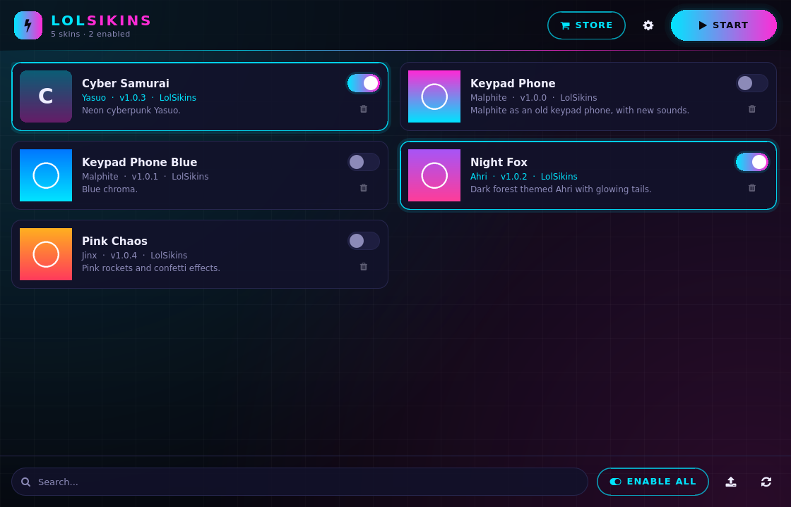
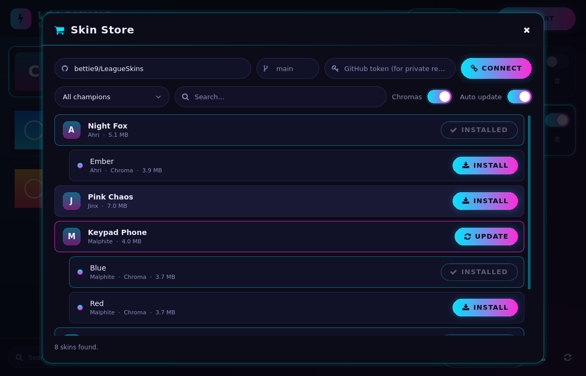

# LolSikins

A custom skin manager for League of Legends with a built-in skin store. Skins only show up on your own screen; everyone else in the match sees the normal skins.

**[Download LolSikins for Windows](../../releases/latest)** · Free and open source (GPL-3.0)



## Features

- **Skin store:** reads a GitHub repository of `.fantome` files, lists the skins and their chromas by champion, and installs the ones you pick with one click. It opens on `bettie9/LeagueSkins` and works with any other repository, private ones included.
- **Auto-update:** when a skin changes in the repository, the installed copy is updated for you.
- **Simple controls:** turn skins on and off, enable them all at once, search, or import your own `.fantome` files.
- **Neon interface** in English, Turkish and Kurdish (Kurmanji), with four color themes.
- **Optional anti-skinhack scan** that stops skins which fail the scan (off by default because it can cost FPS).



## Quick start

1. Download `LolSikins-windows.zip` from the [latest release](../../releases/latest) and extract the whole zip into a folder.
2. Run `LolSikins.exe`. Windows may warn about an unknown publisher: choose **More info → Run anyway**.
3. Pick your League of Legends folder in the settings.
4. Open the **Store**, install a skin, turn it on and press **START**. Then join a match.

## How it works

LolSikins builds an overlay from the skins you turned on. While you play, the patcher makes the game load those files instead of the original ones, so nothing in your game folder is changed and the skins are only visible on your screen.

## FAQ

- **Can I get banned?** Riot's terms of service do not allow third-party programs that change game files. Custom skin tools are widely used, but the risk is yours.
- **Can I use Riot's paid skins?** No. LolSikins is for fan-made skins only.
- **My antivirus or Windows complains.** The patcher attaches to the game, which antivirus software often dislikes, and the files are not signed by a trusted publisher. The full source code is in this repository and in every download.
- **Skins do not show up in game.** Look at `log.txt` next to `LolSikins.exe`. If it says the patcher reached its end of life, download the latest release.

## Rules

- Fan-made, original custom skins only. No copies of Riot's paid skins and no mods that give an advantage in game (range indicators, hitboxes and so on).
- The **Anti-skinhack scan** in the settings is off by default because it costs a lot of FPS on some machines. While it is off, a skin that fails the scan does not stop the patcher, only a warning goes to `log.txt`. When it is on, skins are stopped if one fails the scan.

## Package

GitHub Actions builds every push to `main` and replaces the [latest release](../../releases/latest) with the new build.

```
LolSikins.exe      the program
README.txt         short user guide
tools/             mod-tools and helper tools
patcher/           the patcher that applies skins to the game
licenses/          licenses, third-party notices and the source code (LolSikins-source.zip)
```

## Sharing

Share the release zip. Do not share your own folder: `config.ini` holds your GitHub token.

Legal notes:

- The code is GPL-3.0 ([LICENSE](LICENSE)). Anyone who receives the program must also be able to get its source code, so the package contains it as `licenses/LolSikins-source.zip`. Third-party licenses: [dist/licenses](dist/licenses).
- The patcher files come from the official LTK Manager release. Its license ([LTK-PATCHER-LICENSE.md](https://github.com/LeagueToolkit/ltk-manager/blob/main/LTK-PATCHER-LICENSE.md)) requires League Toolkit's signature to be removed when they are distributed with another program, and allows signing them with your own certificate. The build first checks that the download is the genuine signed file, then removes that signature. LolSikins does not claim to be official or affiliated with League Toolkit.

### Our own signature (optional)

When the `SIGNING_CERT` and `SIGNING_PASSWORD` secrets exist, the build signs `LolSikins.exe`, the tools and the patcher with that certificate. Without them the package is unsigned. The certificate is self-signed, so Windows still shows "unknown publisher"; the signature only shows who distributed the files.

One-time setup, in PowerShell on Windows:

```powershell
$cert = New-SelfSignedCertificate -Type CodeSigningCert -Subject "CN=LolSikins" -KeyAlgorithm RSA -KeyLength 3072 -HashAlgorithm SHA256 -NotAfter (Get-Date).AddYears(10) -CertStoreLocation Cert:\CurrentUser\My
$password = Read-Host "Certificate password" -AsSecureString
Export-PfxCertificate -Cert $cert -FilePath "$HOME\Desktop\lolsikins-signing.pfx" -Password $password
[Convert]::ToBase64String([IO.File]::ReadAllBytes("$HOME\Desktop\lolsikins-signing.pfx")) | Set-Clipboard
```

Then in the repository go to **Settings → Secrets and variables → Actions → New repository secret** and add `SIGNING_CERT` (paste the clipboard) and `SIGNING_PASSWORD` (the password). Keep the `.pfx` file on your desktop somewhere safe or delete it.

## When the patcher expires

The patcher has an end-of-life date. When it is reached the program shows "The patcher reached its end of life". Then:

1. In the repository press **Actions → Build Windows → Run workflow**. The build fetches the patcher of the latest official LTK Manager release.
2. Download the new release zip and extract it over the old folder (installed skins stay in `installed/`).

`version.txt` in the package tells which patcher version it contains.

## Skin store

The cart icon in the top bar opens the store. By default it reads `bettie9/LeagueSkins`. To use another repository, enter its address (`user/repo`), the branch and, for a private repository, a GitHub token, then press **Connect**. The program finds every `.fantome` file in the repository and lists them by champion. Only the skins you **Install** are downloaded.

Suggested layout (not required):

```
Malphite/
  KeypadPhone.fantome
  chromas/
    KeypadPhone/
      Blue.fantome
      Red.fantome
```

- The champion is the name of the first folder under `skins/` (or the repository root). Files outside a folder are listed under "Diğer".
- A file in a subfolder of a champion folder is a chroma. The `chromas` folder name is ignored; the folder under it names the skin the chroma belongs to and must match the main skin's file name. Chromas show up under their skin as `↳ Blue`. `Malphite/KeypadPhone/Blue.fantome` works the same way.
- Skins are installed as "Malphite - KeypadPhone", chromas as "Malphite - KeypadPhone - Blue (Chroma)".
- Renaming a file or folder makes it a new skin; the old one stays installed.

### Auto-update

With "Auto-update" on (the default) the program checks the repository at startup and every 30 minutes. If the file of an installed skin changed, it downloads the new one and installs it in place, keeping its on/off state in the profile. Nothing is updated while the game runs; the queued updates continue after it closes. With auto-update off, changed skins get an **Update** button.

The token is stored in plain text in `config.ini`. Use a fine-grained token that can only read that one repository (Contents: Read-only).

## Disclaimer

LolSikins isn't endorsed by Riot Games and doesn't reflect the views or opinions of Riot Games or anyone officially involved in producing or managing Riot Games properties. Riot Games, and all associated properties are trademarks or registered trademarks of Riot Games, Inc.
